<!--- TECHNOLOGIES -->
[.NET]: https://dot.net/
[Arch Linux]: https://archlinux.org/
[C]: https://learn.microsoft.com/en/cpp/c-language/
[CSharp]: https://learn.microsoft.com/en/dotnet/csharp/
[CSS3]: https://css3.com/
[DBeaver]: https://dbeaver.io/
[Docker]: https://www.docker.com/
[HTML5]: https://html.com/html5/
[Java]: https://www.oracle.com/java/
[JavaScript]: https://www.javascript.com/
[Jest]: https://jestjs.io/
[Linux]: https://github.com/torvalds/linux
[MongoDB]: https://www.mongodb.com/
[MUI]: https://mui.com/
[MySQL]: https://www.mysql.com/
[Next]: https://nextjs.org/
[Node]: https://nodejs.org/
[PostgreSQL]: https://www.postgresql.org/
[Postman]: https://www.postman.com/
[Python]: https://www.python.org/
[React]: https://pt-br.reactjs.org/
[Spring Boot]: https://spring.io/
[SQL Server]: https://www.microsoft.com/en/sql-server/
[TailwindCSS]: http://tailwindcss.com/
[TypeScript]: https://www.typescriptlang.org/
[Vite]: https://vitejs.dev/
[VSCode]: https://code.visualstudio.com/
[Windows]: https://www.microsoft.com/pt-br/software-download/windows11

<!-- SOCIAL MEDIA --->
[Discord]: https://discord.com/invite/2gu54uG9
[GitLab]: https://gitlab.com/wesleybarbosa/
[Gmail]: mailto:wesley.barbosa.developer@gmail.com
[Instagram]: https://www.instagram.com/wesleydeveloper/
[Linkedin]: https://www.linkedin.com/in/wesleybarbosasilva/
[Microsoft Learn]: https://learn.microsoft.com/en-us/users/wesleybarbosa/
[X]: https://x.com/wesleydeveloper/

<!-- CONTRIBUTIONS -->
[PicPay]: https://picpay.me/wesley3g
[PIX]: https://raw.githubusercontent.com/wesleey/wesleey/main/pix

<div align="center">

[](https://github.com/wesleey?tab=followers)
[](https://github.com/wesleey?tab=stars)
[](https://github.com/wesleey?tab=repositories)
[](https://gist.github.com/wesleey)
[](https://github.com/wesleey)
</div>

```bash
[root@linux github]# date
Fri 05 Sep 2025 00:29:57 -0300
```


<div align="center">
<!-- TABLE 1 -->
<table>
<tbody>

<!-- ROW 1 -->
<tr>
<td valign="top">
<h5 align="left">

Technologies
</h5>
<table>
<tbody>
<tr><td>

[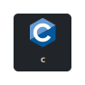][C]
[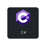][CSharp]
[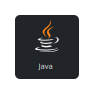][Java]
[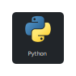][Python]
[][JavaScript]
[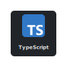][TypeScript]
</td></tr>

<tr><td>

[][.NET]
[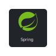][Spring Boot]
[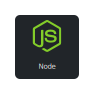][Node]
[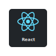][React]
[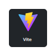][Vite]
[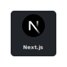][Next]
</td></tr>

<tr><td>

[][HTML5]
[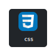][CSS3]
[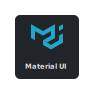][MUI]
[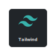][TailwindCSS]
[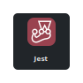][Jest]
[][MongoDB]
</td></tr>

<tr><td>

[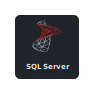][SQL Server]
[][PostgreSQL]
[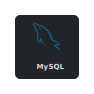][MySQL]
[][VSCode]
[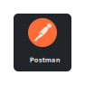][Postman]
[][DBeaver]
</td></tr>

<tr><td>

[][Docker]
[][Windows]
[][Arch Linux]
[][Linux]
</td></tr>
</tbody>
</table>
</td>

<td valign="top">
<h5 align="left">

Certificates
</h5>
<table>
<tbody align="left">
<tr><td><a href="https://www.github.com/" target="_blank" rel="noreferrer noopener"> </a> <a href="https://www.credly.com/badges/3200c6b8-1a37-4c9c-b93d-fcdb907d32a4/linked_in_profile" target="_blank" rel="noreferrer noopener">GitHub Foundations</a>
</td></tr>

<tr><td><a href="https://www.oracle.com/" target="_blank" rel="noreferrer noopener"> </a> <a href="https://catalog-education.oracle.com/ords/certview/sharebadge?id=9C592D53CDF3FCD630537DDE1E418789733DDA68FEE3DD811B68BB6EC7178353" target="_blank" rel="noreferrer noopener">Cloud Infrastructure 2024 Certified Foundations Associate</a>
</td></tr>

<tr><td><a href="https://www.ibm.com/" target="_blank" rel="noreferrer noopener"> </a> <a href="https://www.credly.com/badges/80fdba37-818b-409b-8f1b-528daf855d4e/linked_in_profile" target="_blank" rel="noreferrer noopener">Docker Essentials: A Developer Introduction</a>
</td></tr>

<tr><td><a href="https://www.nvidia.com/" target="_blank" rel="noreferrer noopener"> </a> <a href="https://learn.nvidia.com/certificates?id=ZERS6pTjSmCpPsh90LbCkQ" target="_blank" rel="noreferrer noopener">NVIDIA: Fundamentals of Deep Learning</a>
</td></tr>

<tr><td><a href="https://cloud.google.com/" target="_blank" rel="noreferrer noopener"> </a> <a href="https://www.cloudskillsboost.google/public_profiles/13ce8c60-5b9e-4ca1-96b8-2a0b9a28bd25/badges/9601795?utm_medium=social&utm_source=linkedin&utm_campaign=ql-social-share" target="_blank" rel="noreferrer noopener">Google Cloud: Introduction to Generative AI</a>
</td></tr>

<tr><td><a href="https://www.harvard.edu/" target="_blank" rel="noreferrer noopener"> </a> <a href="https://certificates.cs50.io/56308b0f-af7b-4e53-835f-bdf163fa7fa7" target="_blank" rel="noreferrer noopener">CS50AI: Introduction to Artificial Intelligence with Python</a>
</td></tr>

<tr><td><a href="https://www.harvard.edu/" target="_blank" rel="noreferrer noopener"> </a> <a href="https://cs50.harvard.edu/certificates/e1238850-d867-4e21-9ae2-4fc0255746e8" target="_blank" rel="noreferrer noopener">CS50P: Introduction to Programming with Python</a>
</td></tr>

<tr><td><a href="https://www.harvard.edu/" target="_blank" rel="noreferrer noopener"> </a> <a href="https://cs50.harvard.edu/certificates/75ef015e-97ac-4cd2-aee9-2530f0092f7a" target="_blank" rel="noreferrer noopener">CS50x: Introduction to Computer Science</a>
</td></tr>
</tbody>
</table>
</td>
</tr>
<!-- ROW 1 -->

<!-- ROW 2 -->
<tr>
<td valign="top">
<h5 align="left">

Most Used Languages
</h5>
<table align="center">
<tbody>
<tr>
<div align="center"></div>
</tr>
</tbody>
</table>
</td>

<td valign="top">
<h5 align="left">

Statistics
</h5>
<table align="center">
<tbody>
<tr>
<div align="center"></div>
</tr>
</tbody>
</table>
</td>
</tr>
<!-- ROW 2 -->

<!-- ROW 3 -->
<tr>
<td colspan="2">
<h5 align="left">

QR Codes
</h5>
<table>
<tbody><tr>
<td align="center"><h5 align="center"> PicPay</h5></td>
<td align="center"><h5 align="center"> PIX</h5></td>
<td align="center"><h5 align="center"> GitHub</h5></td>
</tr></tbody>
</table>
</br>
</td>
</tr>
<!-- ROW 3 -->

</tbody>
</table>
<!-- TABLE 1 -->

[][Microsoft Learn]
[][GitLab]
[][Instagram]
[][X]
[][Discord]
[][Linkedin]
[][Gmail]
[][PicPay]
[][PIX]
<div>

<p>Buy me a coffee ☕</p>
