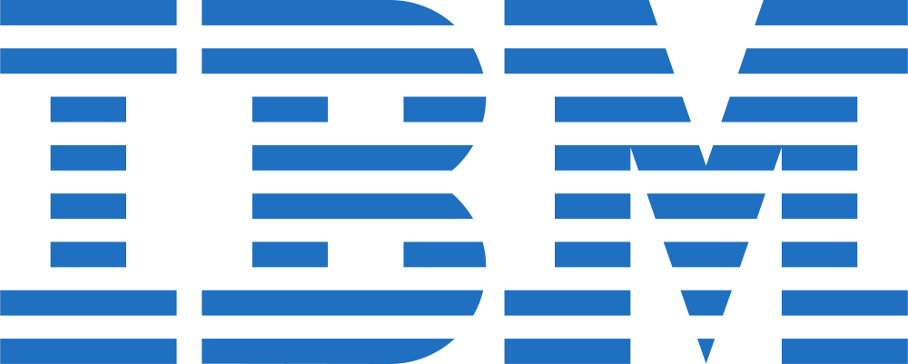

[Microsoft Learn]: https://learn.microsoft.com/en-us/users/wesleybarbosa/
[GitLab]: https://gitlab.com/wesleybarbosa/
[Instagram]: https://www.instagram.com/wesleydeveloper/
[X]: https://x.com/wesleydeveloper/
[Discord]: https://discord.com/invite/2gu54uG9
[Linkedin]: https://www.linkedin.com/in/wesleybarbosasilva/
[Gmail]: mailto:wesley.barbosa.developer@gmail.com

<table>
<tbody>

<tr>
<td valign="top">

#### Technologies
<table>
<tbody>
<tr><td>

</td></tr>

<tr><td>

</td></tr>

<tr><td>

</td></tr>

<tr><td>

</td></tr>

<tr><td>

</td></tr>

</tbody>
</table>

####
</td>

<td valign="top">

#### Certificates
<table>
<tbody>
<tr><td> <a href="https://www.credly.com/badges/3200c6b8-1a37-4c9c-b93d-fcdb907d32a4/linked_in_profile" target="_blank" rel="noreferrer noopener">GitHub Foundations</a>
</td></tr>

<tr><td> <a href="https://www.credly.com/badges/80fdba37-818b-409b-8f1b-528daf855d4e/linked_in_profile" target="_blank" rel="noreferrer noopener">Docker Essentials: A Developer Introduction</a>
</td></tr>

<tr><td> <a href="https://learn.nvidia.com/certificates?id=ZERS6pTjSmCpPsh90LbCkQ" target="_blank" rel="noreferrer noopener">NVIDIA: Fundamentals of Deep Learning</a>
</td></tr>

<tr><td> <a href="https://www.cloudskillsboost.google/public_profiles/13ce8c60-5b9e-4ca1-96b8-2a0b9a28bd25/badges/9601795?utm_medium=social&utm_source=linkedin&utm_campaign=ql-social-share" target="_blank" rel="noreferrer noopener">Google Cloud: Introduction to Generative AI</a>
</td></tr>

<tr><td> <a href="https://certificates.cs50.io/56308b0f-af7b-4e53-835f-bdf163fa7fa7" target="_blank" rel="noreferrer noopener">CS50AI: Introduction to Artificial Intelligence with Python</a>
</td></tr>

<tr><td> <a href="https://cs50.harvard.edu/certificates/e1238850-d867-4e21-9ae2-4fc0255746e8" target="_blank" rel="noreferrer noopener">CS50P: Introduction to Programming with Python</a>
</td></tr>

<tr><td> <a href="https://cs50.harvard.edu/certificates/75ef015e-97ac-4cd2-aee9-2530f0092f7a" target="_blank" rel="noreferrer noopener">CS50x: Introduction to Computer Science</a>
</td></tr>

</tbody>
</table>

####
</td>

</tr>

<tr>
<td valign="top">

#### Most Used Languages
<table align="center">
<tbody>
<tr><td>

</td></tr>

</tbody>
</table>

####
</td>

<td valign="top">

#### Statistics
<table align="center">
<tbody>
<tr><td>

</td></tr>

</tbody>
</table>

####
</td>

</tr>

</table>

##

[][Microsoft Learn]
[][GitLab]
[][Instagram]
[][X]
[][Discord]
[][Linkedin]
[][Gmail]

