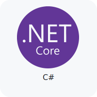
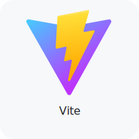

<!--- TECHNOLOGIES -->
[.NET]: https://dot.net/
[Arch Linux]: https://archlinux.org/
[C]: https://learn.microsoft.com/en/cpp/c-language/
[CSharp]: https://learn.microsoft.com/en/dotnet/csharp/
[CSS3]: https://css3.com/
[DBeaver]: https://dbeaver.io/
[Docker]: https://www.docker.com/
[HTML5]: https://html.com/html5/
[Java]: https://www.oracle.com/java/
[JavaScript]: https://www.javascript.com/
[Jest]: https://jestjs.io/
[Linux]: https://github.com/torvalds/linux
[MongoDB]: https://www.mongodb.com/
[MUI]: https://mui.com/
[MySQL]: https://www.mysql.com/
[Next]: https://nextjs.org/
[Node]: https://nodejs.org/
[PostgreSQL]: https://www.postgresql.org/
[Postman]: https://www.postman.com/
[Python]: https://www.python.org/
[React]: https://pt-br.reactjs.org/
[Spring]: https://spring.io/
[SQL Server]: https://www.microsoft.com/en/sql-server/
[TailwindCSS]: http://tailwindcss.com/
[TypeScript]: https://www.typescriptlang.org/
[Vite]: https://vitejs.dev/
[VSCode]: https://code.visualstudio.com/
[Windows]: https://www.microsoft.com/pt-br/software-download/windows11

<!-- CERTIFICATES -->
[GitHub Foundations]: https://www.credly.com/badges/3200c6b8-1a37-4c9c-b93d-fcdb907d32a4/linked_in_profile
[Oracle 2024]: https://catalog-education.oracle.com/ords/certview/sharebadge?id=9C592D53CDF3FCD630537DDE1E418789733DDA68FEE3DD811B68BB6EC7178353
[IBM Docker]: https://www.credly.com/badges/80fdba37-818b-409b-8f1b-528daf855d4e/linked_in_profile
[NVIDIA Deep Learning]: https://learn.nvidia.com/certificates?id=ZERS6pTjSmCpPsh90LbCkQ
[Google Cloud Generative AI]: https://www.cloudskillsboost.google/public_profiles/13ce8c60-5b9e-4ca1-96b8-2a0b9a28bd25/badges/9601795?utm_medium=social&utm_source=linkedin&utm_campaign=ql-social-share
[CS50AI]: https://certificates.cs50.io/56308b0f-af7b-4e53-835f-bdf163fa7fa7
[CS50P]: https://cs50.harvard.edu/certificates/e1238850-d867-4e21-9ae2-4fc0255746e8
[CS50x]: https://cs50.harvard.edu/certificates/75ef015e-97ac-4cd2-aee9-2530f0092f7a

<!-- SOCIAL MEDIA --->
[Discord]: https://discord.com/invite/2gu54uG9
[GitLab]: https://gitlab.com/wesleybarbosa/
[Gmail]: mailto:wesley.barbosa.developer@gmail.com
[Instagram]: https://www.instagram.com/wesleydeveloper/
[Linkedin]: https://www.linkedin.com/in/wesleybarbosasilva/
[Microsoft Learn]: https://learn.microsoft.com/en-us/users/wesleybarbosa/
[X]: https://x.com/wesleydeveloper/

<!-- CONTRIBUTIONS -->
[PicPay]: https://picpay.me/wesley3g
[PIX]: https://raw.githubusercontent.com/wesleey/wesleey/main/pix

<!-- TABLE 1 -->
<table>
<tbody>

<!-- ROW 1 -->
<tr>
<td valign="top">
<h5 align="left">

Technologies
</h5>
<table>
<tbody>
<tr><td>

[<picture><source media="(prefers-color-scheme: dark)" srcset="./technologies/c-dark.svg"></picture>][C]
[<picture><source media="(prefers-color-scheme: dark)" srcset="./technologies/csharp-dark.svg"></picture>][CSharp]
[<picture><source media="(prefers-color-scheme: dark)" srcset="./technologies/java-dark.svg"></picture>][Java]
[<picture><source media="(prefers-color-scheme: dark)" srcset="./technologies/python-dark.svg"></picture>][Python]
[<picture><source media="(prefers-color-scheme: dark)" srcset="./technologies/javascript-dark.svg"></picture>][JavaScript]
[<picture><source media="(prefers-color-scheme: dark)" srcset="./technologies/typescript-dark.svg"></picture>][TypeScript]
[<picture><source media="(prefers-color-scheme: dark)" srcset="./technologies/dotnet-dark.svg"></picture>][.NET]
</td></tr>

<tr><td>

[<picture><source media="(prefers-color-scheme: dark)" srcset="./technologies/spring-dark.svg"></picture>][Spring]
[<picture><source media="(prefers-color-scheme: dark)" srcset="./technologies/node-dark.svg"></picture>][Node]
[<picture><source media="(prefers-color-scheme: dark)" srcset="./technologies/react-dark.svg"></picture>][React]
[<picture><source media="(prefers-color-scheme: dark)" srcset="./technologies/vite-dark.svg"></picture>][Vite]
[<picture><source media="(prefers-color-scheme: dark)" srcset="./technologies/next-dark.svg"></picture>][Next]
[<picture><source media="(prefers-color-scheme: dark)" srcset="./technologies/html-dark.svg"></picture>][HTML5]
[<picture><source media="(prefers-color-scheme: dark)" srcset="./technologies/css-dark.svg"></picture>][CSS3]
</td></tr>

<tr><td>

[<picture><source media="(prefers-color-scheme: dark)" srcset="./technologies/mui-dark.svg"></picture>][MUI]
[<picture><source media="(prefers-color-scheme: dark)" srcset="./technologies/tailwind-dark.svg"></picture>][TailwindCSS]
[<picture><source media="(prefers-color-scheme: dark)" srcset="./technologies/jest-dark.svg"></picture>][Jest]
[<picture><source media="(prefers-color-scheme: dark)" srcset="./technologies/mongodb-dark.svg"></picture>][MongoDB]
[<picture><source media="(prefers-color-scheme: dark)" srcset="./technologies/sqlserver-dark.svg"></picture>][SQL Server]
[<picture><source media="(prefers-color-scheme: dark)" srcset="./technologies/postgresql-dark.svg"></picture>][PostgreSQL]
[<picture><source media="(prefers-color-scheme: dark)" srcset="./technologies/mysql-dark.svg"></picture>][MySQL]
</td></tr>

<tr><td>

[<picture><source media="(prefers-color-scheme: dark)" srcset="./technologies/vscode-dark.svg"></picture>][VSCode]
[<picture><source media="(prefers-color-scheme: dark)" srcset="./technologies/postman-dark.svg"></picture>][Postman]
[<picture><source media="(prefers-color-scheme: dark)" srcset="./technologies/dbeaver-dark.svg"></picture>][DBeaver]
[<picture><source media="(prefers-color-scheme: dark)" srcset="./technologies/docker-dark.svg"></picture>][Docker]
[<picture><source media="(prefers-color-scheme: dark)" srcset="./technologies/windows-dark.svg"></picture>][Windows]
[<picture><source media="(prefers-color-scheme: dark)" srcset="./technologies/arch-dark.svg"></picture>][Arch Linux]
[<picture><source media="(prefers-color-scheme: dark)" srcset="./technologies/linux-dark.svg"></picture>][Linux]
</td></tr>
</tbody>
</table>
</td>

<td valign="top">
<h5 align="left">

Certificates
</h5>
<table>
<tbody>
<tr><td>

[<picture><source media="(prefers-color-scheme: dark)" srcset="./certificates/github-dark.svg"></picture>][GitHub Foundations]
[<picture><source media="(prefers-color-scheme: dark)" srcset="./certificates/ibm-dark.svg"></picture>][IBM Docker]
[<picture><source media="(prefers-color-scheme: dark)" srcset="./certificates/nvidia-dark.svg"></picture>][NVIDIA Deep Learning]
[<picture><source media="(prefers-color-scheme: dark)" srcset="./certificates/harvard-dark.svg"></picture>][CS50x]
[<picture><source media="(prefers-color-scheme: dark)" srcset="./certificates/harvard-dark.svg"></picture>][CS50P]
[<picture><source media="(prefers-color-scheme: dark)" srcset="./certificates/harvard-dark.svg"></picture>][CS50AI]
[<picture><source media="(prefers-color-scheme: dark)" srcset="./certificates/oracle-dark.svg"></picture>][Oracle 2024]
</td></tr>

<tr><td>

[<picture><source media="(prefers-color-scheme: dark)" srcset="./certificates/google-cloud-dark.svg"></picture>][Google Cloud Generative AI]
</td></tr>
</tbody>
</table>

<h5 align="left">

Social media
</h5>
<table>
<tbody>
<tr><td>

[<picture><source media="(prefers-color-scheme: dark)" srcset="./contacts/gmail-dark.svg"></picture>][Gmail]
[<picture><source media="(prefers-color-scheme: dark)" srcset="./contacts/linkedin-dark.svg"></picture>][LinkedIn]
[<picture><source media="(prefers-color-scheme: dark)" srcset="./contacts/microsoft-learn-dark.svg"></picture>][Microsoft Learn]
[<picture><source media="(prefers-color-scheme: dark)" srcset="./contacts/gitlab-dark.svg"></picture>][GitLab]
[<picture><source media="(prefers-color-scheme: dark)" srcset="./contacts/instagram-dark.svg"></picture>][Instagram]
[<picture><source media="(prefers-color-scheme: dark)" srcset="./contacts/x-dark.svg"></picture>][X]
[<picture><source media="(prefers-color-scheme: dark)" srcset="./contacts/discord-dark.svg"></picture>][Discord]
</td></tr>
</tbody>
</table>
</td>
</tr>
<!-- ROW 1 -->

<!-- ROW 2 -->
<tr>
<td valign="top">
<table align="center">
<tbody>
<tr>

</tr>
</tbody>
</table>
</td>

<td valign="top">
<table align="center">
<tbody>
<tr>

</tr>
</tbody>
</table>
</td>
</tr>
<!-- ROW 2 -->

<!-- ROW 3 -->
<tr>
<td align="center" valign="top" colspan="2">
<table>
<tbody>
<tr>
<picture><source media="(prefers-color-scheme: dark)" srcset="./contributions-dark.svg"></picture>
</tr>
</tbody>
</table>
</td>
</tr>
<!-- ROW 3 -->

</tbody>
</table>
<!-- TABLE 1 -->

[][PicPay]

